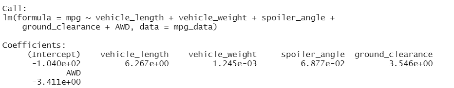
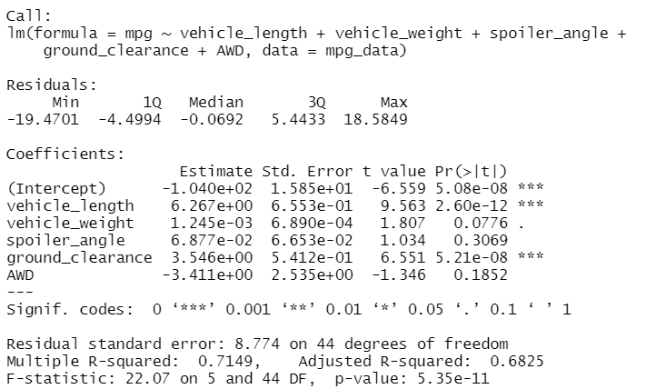
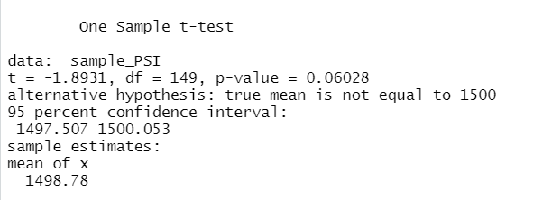
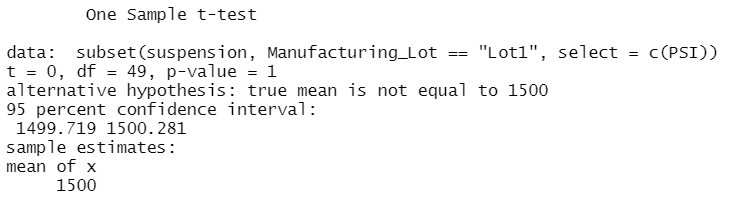
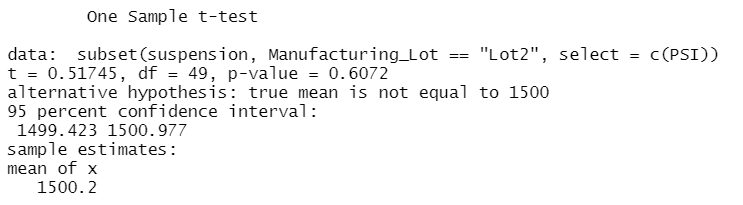
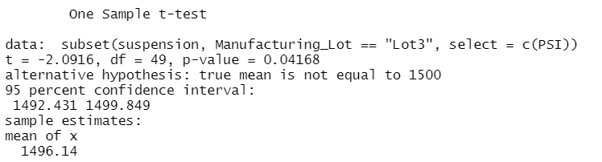

## Linear Regression to Predict MPG

Which variables/coefficients provided a non-random amount of variance to the mpg values in the dataset?
* Vehicle length and ground clearance provided a non-random amount of variance to the mpg values in the dataset. Each value was less than 0.001. Intercept was also a significant variable which may mean that the analysis should be re-evaluated based on additional variables or that the variables we reviewed may need to be scaled or transformed to provide more insight. 

Is the slope of the linear model considered to be zero? Why or why not?
* No, the slope of the linear model is positive based on the positive coefficients of the variables that were tested. 

Does this linear model predict mpg of MechaCar prototypes effectively? Why or why not?
* Yes, with an adjusted R-squared of 0.6825 we can reasonably assume the model can effectively predict the mpg of MechaCar prototypes. A higher r-squared would be preferred and further analysis on the significant variables does indicate the relationship may not be as strong. When the non-significant variables are removed from the multiple linear regression the r-squared values decline. The variables are still significant, but the lower r-squared may indicate the variables need to be reviewed to improve the predictive power of the model. 

## Summary Statistics on Suspension Coils
All lots do not meet the design specifications which state the variance of the suspension coils must not exceed 100 pounds per square inch. Lots 1 and 2 clear the specifications by a significant margin with a variance of 0.98 and 7.47 respectively. Lot 3 has a variance of over 170 which significantly exceeds the specification parameters and indicates potential issues with the manufacturing processes at Lot 3. 

## T-Tests on Suspension Coils
determine if the PSI across all manufacturing lots is statistically different from the population mean of 1,500 pounds per square inch.

* The PSI across all manufacturing lots is not significantly different form the population. A p-value of 0.06028 indicates the difference in the sample and the population mean are not significant.

### Analyzing Suspension for Each Lot
Reviewing each lot as an independent sample it was determined that Lot 3 has significantly different PSI levels than the population and should be reviewed further. A summary of the data follows. 

### Lot 1
* p-value = 1; Accept null hypothesis
* Lot 1 PSI measures are not significantly different than the population mean.
 

### Lot 2
* p-value = 0.6072; Accept null hypothesis
* Lot 2 PSI measures are not significantly different than the population mean.
 

### Lot 3
* p-value = 0.4168; Reject null hypothesis
* Lot 3 PSI measures are significantly different than the population mean. Further analysis should be done on Lot 3 data to determine why the difference is occurring. 
 

## Study Design: MechaCar vs Competition
### Metrics to Test
Fuel Economy (mpg: cty/hwy/combined) based on manufacturer and vehicle body type.

What is the null hypothesis or alternative hypothesis?
Hypothesis 1:
* H null = There is no statistical difference between MechaCar fuel efficiency and the competition.
* H alternative = MechaCar's fuel efficiency is significantly different than the competition. 

*secondary alternative to compare relative difference in fuel efficiency (one-sided t-test)
* MechCar's fuel efficiency is significantly better than the competition.

### Testing Hypothesis
To test the hypothesis MechaCar can run an ANOVA test. An ANOVA test would allow MechaCar to compare the fuel efficiency of its own vehicles and all competitors as categorical variables. For the ANOVA test, fuel efficiency will be the dependent variable and model of vehicle will be the independent variable. A two-way ANOVA test could also be run with a second independent variable such as vehicle body type (SUV, Sedan, etc.).

If the analysis shows a significant different in fuel efficiency between manufacturers or vehicle body types further analysis could be run to determine if the differences are statistically significant at the population level.  

Further analysis could include running a one-sided t-test for MechaCar vehicles overall and specific body-types versus the population dataset. A new alternative hypothesis would need to be tested by stating MechaCar's fuel efficiency is significantly higher or lower than the competition.

### Data Required for Testing
Data necessary to perform the suggested analysis would include a dataframe which included columns for manufacturer, body type, engine type, city mpg, highway mpg, and combined mpg. 